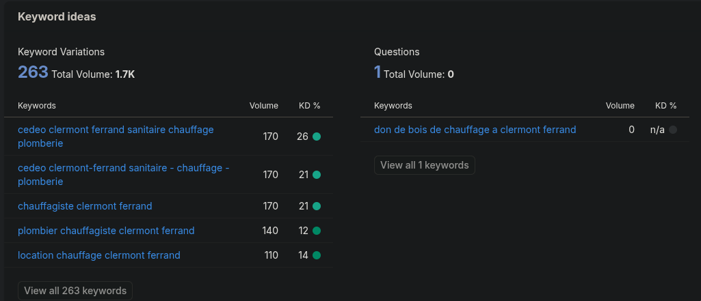

Title takes the name and then appends keywords and the city. So here it's `Aquafix — Plombier Chauffagiste Clermont-Ferrand` + potentially region like `Aquafix — Plombier Chauffagiste Clermont-Ferrand Sud` or what not

//NB: note thtat nobody searches for "Chauffagiste", but many search for . Luckily, by fuzzy logic, it's covered.

UPD: Google kinda doesn't like having a keyword next to city. Eric shows "Plumber done right CITY" as preferrable to "XXX Plumber CITY". But it should be fine for video-verified once though I think.
